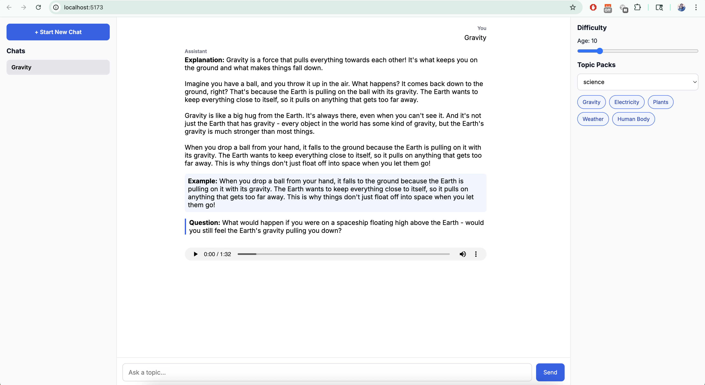
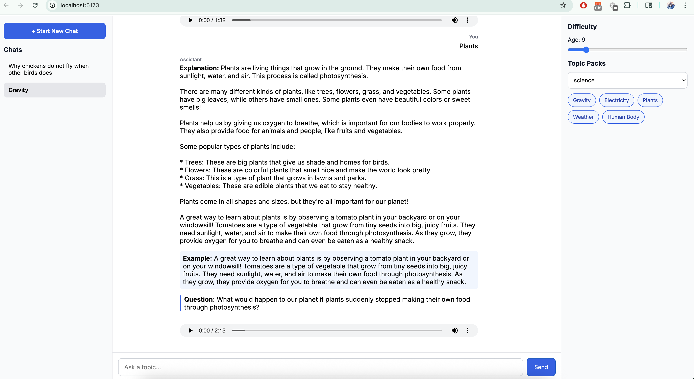
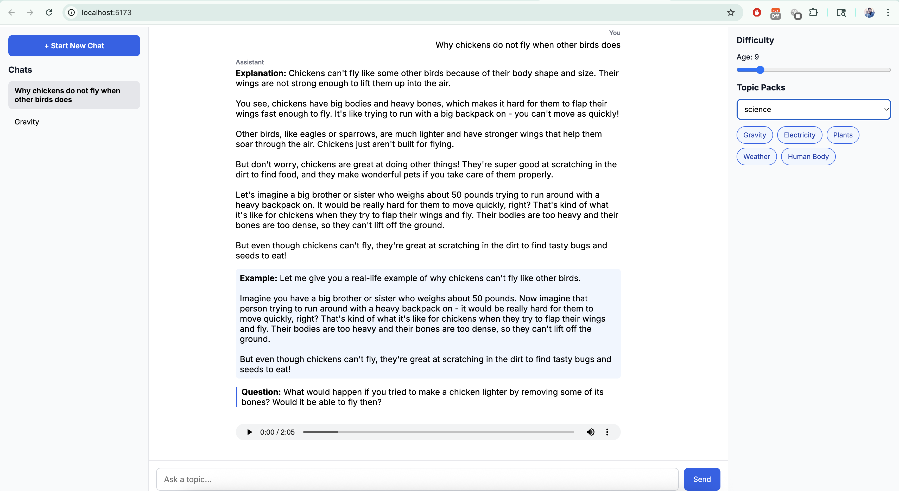

# Explain Like I'm 10 🎓

An intelligent, age-adaptive educational platform powered by **LangGraph** workflows and **Ollama LLM** that generates personalized explanations for any topic based on the user's age and comprehension level.

## 🌟 Project Overview

This project demonstrates advanced AI orchestration using **LangChain** and **LangGraph** to create a sophisticated educational assistant that:

- Generates age-appropriate explanations (ages 5-35)
- Creates relatable examples tailored to the user's context
- Produces thought-provoking follow-up questions
- Ensures content safety through multi-stage validation
- Provides audio narration using text-to-speech
- Manages multi-conversation chat history

## 🧠 AI & Technology Stack

### Backend - AI Orchestration
- **LangGraph**: State machine-based workflow orchestration for multi-step reasoning
- **LangChain**: LLM integration framework with Ollama
- **Ollama**: Local LLM deployment (llama3.1:8b model)
- **FastAPI**: High-performance async API framework
- **Pydantic**: Type-safe data validation and modeling
- **gTTS**: Google Text-to-Speech for audio generation

### Frontend - Modern React
- **React 18**: Component-based UI with hooks
- **Vite**: Next-generation frontend tooling
- **CSS Grid/Flexbox**: Responsive three-column layout
- **Inter Font**: Professional typography

## 🔄 LangGraph Workflow Architecture

The application uses a **directed acyclic graph (DAG)** to orchestrate the explanation generation process:

```
┌─────────────┐
│   START     │
└──────┬──────┘
       │
       v
┌─────────────────┐
│   Simplify      │  ← Generate age-appropriate explanation
│   (LLM Node)    │
└──────┬──────────┘
       │
       v
┌─────────────────┐
│  Add Example    │  ← Create relatable example
│   (LLM Node)    │
└──────┬──────────┘
       │
       v
┌─────────────────┐
│ Think Question  │  ← Generate thought-provoking question
│   (LLM Node)    │
└──────┬──────────┘
       │
       v
┌─────────────────┐
│  Safety Check   │  ← Validate content appropriateness
│   (LLM Node)    │
└──────┬──────────┘
       │
       v
┌─────────────┐
│     END     │
└─────────────┘
```

### Key LangGraph Features Demonstrated

1. **State Management**: Maintains conversation context across nodes
   ```python
   class ExplainState(TypedDict):
       topic: str
       age: int
       explanation: str
       example: str
       question: str
       safe_text: str
   ```

2. **Conditional Routing**: Dynamic workflow based on state
3. **Multi-Agent Reasoning**: Each node serves as a specialized agent
4. **Sequential Processing**: Ensures logical flow of explanation generation
5. **Error Handling**: Graceful degradation if any node fails

## 🎯 AI Capabilities & Skills Demonstrated

### 1. **Dynamic Prompt Engineering**
- Age-adaptive prompt templates
- Context-aware content generation
- Multi-turn conversation handling

### 2. **Workflow Orchestration with LangGraph**
- **State Graph Design**: Manages complex multi-step AI workflows
- **Node Specialization**: Each LangGraph node has a specific responsibility
- **Edge Management**: Controls the flow between AI processing steps
- **State Persistence**: Maintains context throughout the workflow

### 3. **LLM Integration Patterns**
- **Ollama Integration**: Local LLM deployment for privacy and control
- **Temperature Control**: Fine-tuned for consistent, factual responses
- **Streaming Support**: Ready for real-time response generation
- **Model Abstraction**: Easy to swap LLM providers

### 4. **Content Safety & Validation**
- Multi-stage safety checking
- Age-appropriate content filtering
- Automated content review pipeline

### 5. **Hybrid AI Pipeline**
- LLM for content generation
- TTS for multimodal output
- Rule-based content parsing and formatting

## 📁 Project Structure

```
explain-10/
├── backend/                    # Python FastAPI backend
│   ├── main.py                # Application entry point
│   ├── graph.py               # LangGraph workflow definitions
│   ├── routes.py              # API endpoints
│   ├── models.py              # Pydantic data models
│   ├── config.py              # Configuration & LLM setup
│   ├── tts.py                 # Text-to-speech integration
│   ├── topic_packs.py         # Pre-defined topics
│   ├── requirements.txt       # Python dependencies
│   ├── audio/                 # Generated audio files
│   └── README.md              # Backend documentation
│
└── explain-like-im-10/        # React frontend
    ├── src/
    │   ├── App.jsx            # Main React component
    │   ├── App.css            # Component styles
    │   ├── index.css          # Global styles
    │   └── main.jsx           # React entry point
    ├── public/                # Static assets
    ├── package.json           # Node dependencies
    ├── vite.config.js         # Vite configuration
    └── README.md              # Frontend documentation
```

## 🚀 Quick Start

### Prerequisites
- Python 3.10+
- Node.js 16+
- Ollama with llama3.1:8b model

### Backend Setup

```bash
# Install Ollama
brew install ollama  # macOS
# or visit https://ollama.ai for other platforms

# Pull the LLM model
ollama pull llama3.1:8b

# Navigate to backend
cd backend

# Create virtual environment
python -m venv venv
source venv/bin/activate  # macOS/Linux
# or venv\Scripts\activate on Windows

# Install dependencies
pip install -r requirements.txt

# Create audio directory
mkdir -p audio

# Start the server
python main.py
```

Backend runs at: `http://localhost:8000`

### Frontend Setup

```bash
# Navigate to frontend
cd explain-like-im-10

# Install dependencies
npm install

# Start development server
npm run dev
```

Frontend runs at: `http://localhost:5173`

## 📊 API Architecture

### Core Endpoints

#### POST /explain
```json
{
  "topic": "Quantum Physics",
  "age": 15
}
```

**Response:**
```json
{
  "sections": {
    "Explanation": "Quantum physics is the study of...",
    "Example": "Imagine you have a coin that...",
    "Question": "What do you think would happen if..."
  },
  "audio_url": "/audio/1703345678.mp3"
}
```

#### GET /topics
Returns categorized topic suggestions

#### GET /audio/{file_name}
Streams generated audio with proper CORS headers

## 🎨 Features

### Intelligent Adaptability
- **Age-Responsive**: Content complexity scales from ages 5 to 35
- **Context-Aware Examples**: Generates examples relevant to age group
- **Progressive Questioning**: Encourages critical thinking at appropriate levels

### User Experience
- **Multi-Chat Support**: Manage multiple conversation threads
- **Auto-Scroll**: Seamless chat experience
- **Audio Playback**: Single-play enforcement across multiple messages
- **Topic Packs**: Quick-start with curated topics

### Technical Excellence
- **Type Safety**: Pydantic models for data validation
- **CORS Configured**: Secure cross-origin resource sharing
- **Clean Architecture**: Separation of concerns
- **Responsive Design**: Three-column grid layout

## 🔧 Configuration

### LLM Settings (`config.py`)
```python
LLM_MODEL = "llama3.1:8b"      # Model selection
LLM_TEMPERATURE = 0             # Deterministic responses
```

### Frontend Settings
- **Grid Layout**: `286px | 1fr | 330px` (left | center | right)
- **Age Range**: 5-35 years
- **Font**: Inter with system fallbacks

## 🌐 LangGraph Workflow Details

### Node Functions

**1. Simplify Node**
- Generates core explanation
- Adapts language complexity to age
- Maintains factual accuracy

**2. Add Example Node**
- Creates age-appropriate analogies
- Uses familiar scenarios
- Reinforces understanding

**3. Think Question Node**
- Generates critical thinking prompts
- Encourages deeper exploration
- Age-appropriate complexity

**4. Safety Check Node**
- Reviews content for appropriateness
- Filters mature themes
- Ensures educational value

### State Flow
```python
ExplainState → Simplify → Add Example → Think Question → Safety Check → Output
```

## 📈 Skills Demonstrated

### AI/ML Engineering
✅ LangGraph workflow orchestration  
✅ LangChain LLM integration  
✅ Prompt engineering & optimization  
✅ State machine design  
✅ Multi-agent reasoning systems  
✅ Content safety & validation  

### Backend Development
✅ FastAPI async architecture  
✅ RESTful API design  
✅ CORS configuration  
✅ File streaming & management  
✅ Type-safe data modeling  

### Frontend Development
✅ React hooks & state management  
✅ Responsive CSS Grid/Flexbox  
✅ Event handling & audio sync  
✅ Component architecture  
✅ API integration  

### DevOps & Architecture
✅ Microservices design  
✅ Environment configuration  
✅ Dependency management  
✅ Documentation practices  

## 🔍 Use Cases

1. **Educational Technology**: Personalized learning experiences
2. **Content Adaptation**: Age-appropriate content generation
3. **AI Workflow Demonstration**: Complex LangGraph orchestration
4. **LLM Integration**: Local AI deployment patterns
5. **Full-Stack AI**: End-to-end AI application development

## 🎓 Learning Outcomes

This project showcases:
- **Advanced AI orchestration** using LangGraph state machines
- **Production-ready LLM integration** with Ollama and LangChain
- **Practical prompt engineering** for adaptive content generation
- **Full-stack AI application** development from backend to frontend
- **Best practices** in API design, state management, and user experience

## 📝 Documentation

- [Backend Documentation](backend/README.md) - API, setup, and architecture
- [Frontend Documentation](explain-like-im-10/README.md) - UI, features, and customization

## 🤝 Contributing

This project demonstrates best practices in:
- Type-safe AI workflows
- Modular architecture
- Comprehensive documentation
- Clean code principles

## 📄 License

MIT License - Feel free to use this project as a reference or starting point for your own AI-powered applications.

---

**Built with ❤️ using LangGraph, LangChain, and modern web technologies**

## UI Screens:







